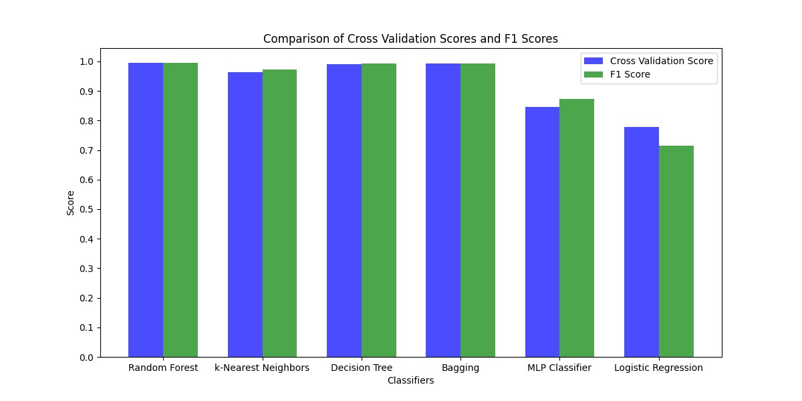
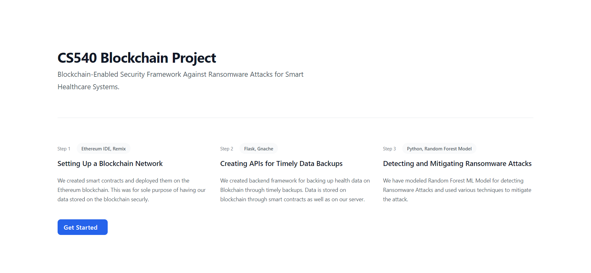
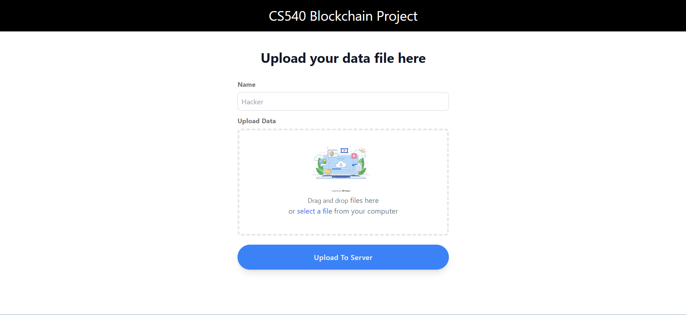
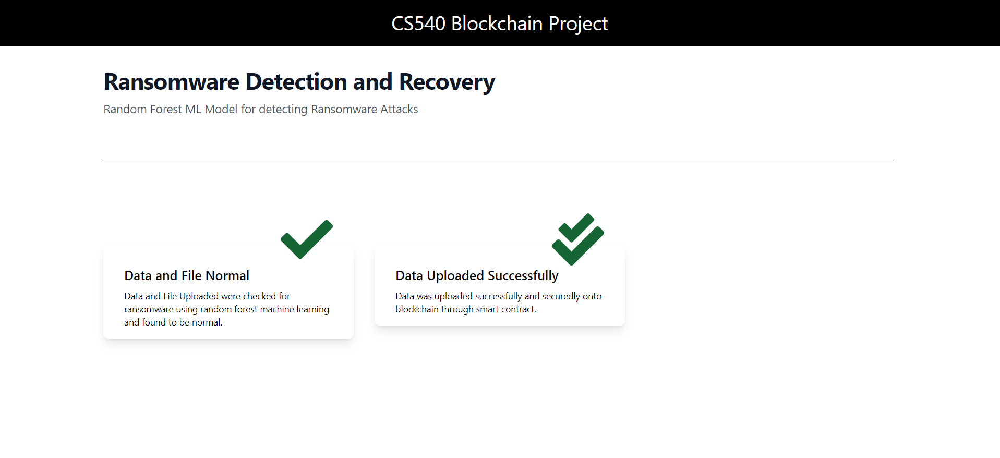
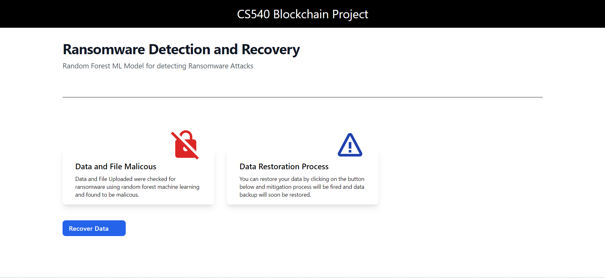

# BSFR-SH: Blockchain-Enabled Security Framework Against Ransomware Attacks for Smart Healthcare

## Introduction

The healthcare industry is increasingly becoming reliant on smart healthcare applications, which utilize peer-to-peer cloud servers to store and manage patient data. However, this reliance has introduced a critical security vulnerability, as ransomware attacks have become a prevalent threat targeting these systems. Ransomware attacks encrypt patient data, rendering it inaccessible and demanding ransom payments for decryption. To address this challenge, a robust and secure framework is essential for protecting sensitive patient information and maintaining the integrity of smart healthcare systems.

## Problem Details

The primary challenge lies in securing smart healthcare applications on peer-to-peer cloud servers against ransomware attacks. These attacks exploit vulnerabilities in cloud-based systems to encrypt patient data, disrupting operations and jeopardizing patient care. Traditional security measures often prove ineffective against these sophisticated attacks, necessitating a more comprehensive and resilient approach.


## System Model

### a) System
The system is responsible for creating secure data backups and transmitting them to the cloud server at regular intervals. It employs blockchain technology to generate data backups and integrates features for ransomware detection.

### b) Cloud Server
The cloud server securely stores the transmitted data backups and plays a pivotal role in the recovery process.


## Data Backup Process

1. **Backup Creation:**
   - The system generates data backups through blockchain technology at specified intervals.

2. **Secure Transmission:**
   - Created backups are securely sent to the cloud server for storage.

## DataBackup and RansomWare Smart Contracts

### DataBackup Contract

#### Functions
- **register():** Registers the system and returns a unique system ID.
- **getSystemId():** Retrieves the system ID for the calling address.
- **uploadFile(file):** Uploads a file to the system, triggering a DataUpload event.
- **startNewSnapshot():** Initiates a new data snapshot for the registered system.
- **snapshotId():** Retrieves the current snapshot ID for the calling address.

### RansomWare Contract

#### Function
- **addEntry(entry):** Adds an entry to the ransomware detection system, triggering an Entry event.

## Usage

1. Deploy the DataBackup and RansomWare contracts on a compatible Ethereum blockchain.
2. Register your system using the `register()` function in the DataBackup contract.
3. Retrieve your system ID with `getSystemId()`.
4. Upload files using the `uploadFile(file)` function.
5. Initiate new snapshots with `startNewSnapshot()`.
6. Monitor ransomware entries with the `addEntry(entry)` function in the RansomWare contract.


## Ransomware Detection and Mitigation

1. **ML Model Integration:**
   - The system incorporates a pre-trained ML model to analyze every executable file.

2. **Detection Mechanism:**
   - For each uploaded file, the system checks if it is malicious or benign using multiple ML models.

3. **Mitigation Strategies:**
   - Upon detection of ransomware, the system initiates mitigation procedures.
   - Mitigation strategies include isolating the ransomware, erasing it, or formatting the system.
   - Data recovery is performed from the blockchain of data backups based on the chosen mitigation strategy.

By seamlessly integrating data backup, blockchain, and machine learning capabilities, the BSFR-SH framework ensures a robust approach to data security and ransomware mitigation.


## Experimental Setup

We have tested our framework using a web application where a user can upload .exe file to check if it has ransomware or not. Our server identifies it as malicious or not, and then displays the result on same. 
## Installation 

### Starting Our Web Application:


```bash
# Navigate to the frontend directory
cd frontend 

# Install dependencies
npm install

# Start the application
npm run start

# Install backend dependencies
pip install -r ./requirment.txt

# Install ganache globally
npm install -g ganache

# Run the server
python server.py

```

## Results and Analysis

The results of our experiments demonstrate that BSFR-SH is exceptionally effective in detecting and preventing ransomware attacks. We conducted tests using various classifier models, including Random Forest, K-Nearest Neighbors, MLP Classifier, and Logistic Regression etc. The framework consistently achieved a remarkable cross-validation score of 99.48%.

These findings underscore the robustness and reliability of the BSFR-SH framework in the face of ransomware threats. It showcases the efficiency of the implemented classifier models in accurately identifying and thwarting potential attacks. 


Figure-1

Figure-2

Figure-3

Figure-4


